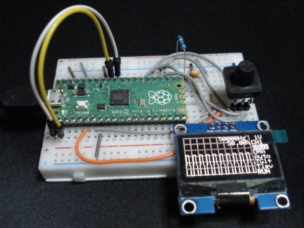
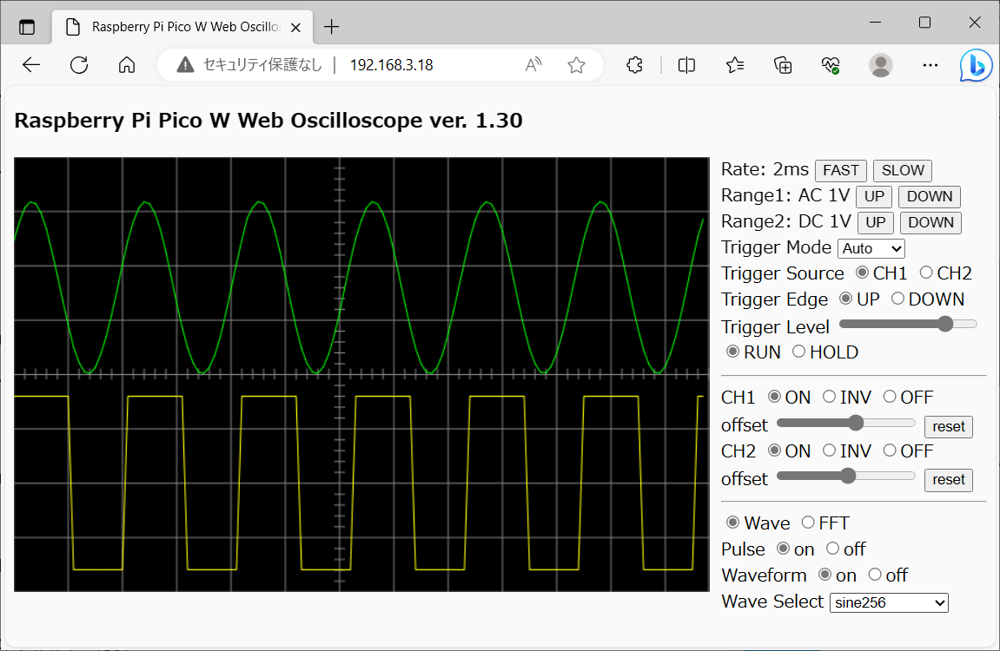
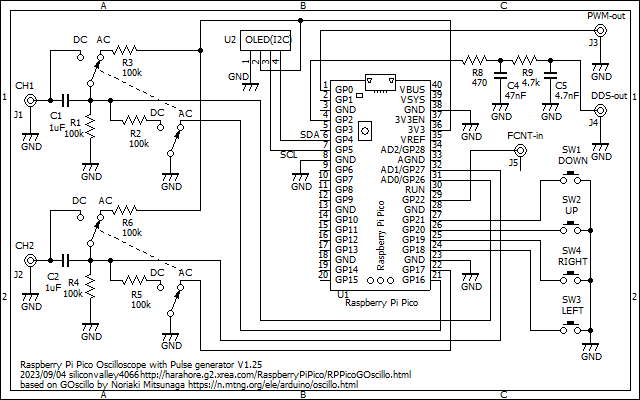

# RaspberryPiPicoWOLEDOscilloscope
Raspberry Pi Pico W dual channel Oscilloscope for OLED and wireless WEB display

This displays an oscilloscope screen on a 128x64 OLED and also on the WEB page simultaneusly.
The settings are controled by the 5 direction switch and also on the WEB page.
You can view the oscilloscope screen on the WEB browser of the PC or the tablet or the smartphone.
It contains Pulse Generator, DDS Function Generator and Frequency Counter.

The source codes can be compiled for Raspberry Pi Pico (not W) without WEB functions.

For WEB operations, edit the source code WebTask.ino and replace your Access Point and the password.
<pre>
Edit:
const char* ssid = "XXXX";
const char* pass = "YYYY";
To:
const char* ssid = "Your Access Point";
const char* pass = "Your Password";
</pre>

Develop environment is: 
Arduino IDE 1.8.19 
Raspberry Pi Pico/RP2040 by Earle F. Philhower, III version 3.4.0 
CPU speed 125MHz 

Libraries: 
Adafruit_SSD1306 
Adafruit_SH110X 
arduinoFFT by Enrique Condes 2.0.0 

2usec/div range is 10 times magnification at 500ksps. 
4usec/div range is 5 times magnification at 500ksps. 
The magnification applies sin(x)/x interpolation.

Schematics: 

Description is here, although it is written in Japanese language:
http://harahore.g2.xrea.com/RaspberryPiPico/RPPicoGOscillo.html
