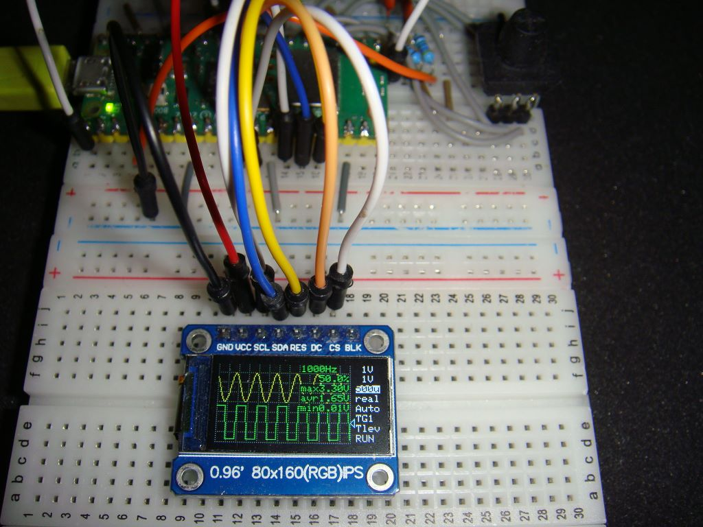
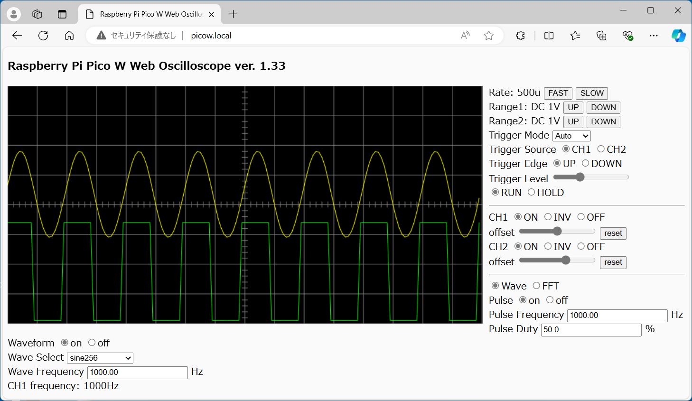
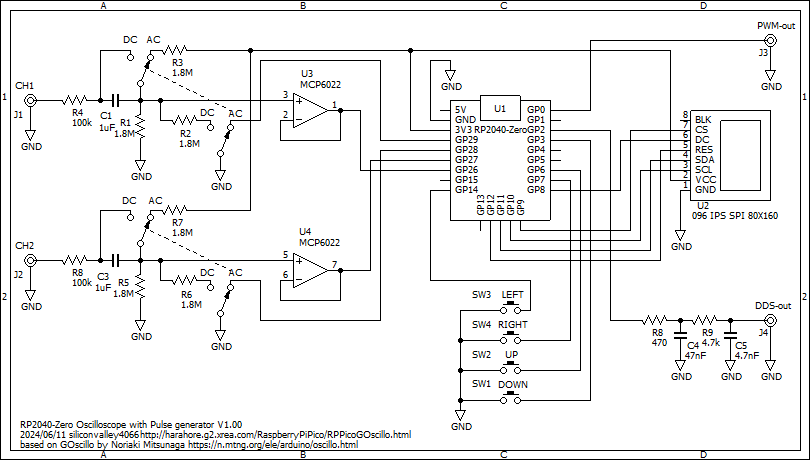

# RaspberryPiPicoWIPSOscilloscope
Raspberry Pi Pico W dual channel Oscilloscope for 80x160 IPS TFT and wireless WEB display

This displays an oscilloscope screen on a 80x160 IPS TFT and also on the WEB page simultaneusly.
The settings are controled by the 5 direction switch and also on the WEB page.
You can view the oscilloscope screen on the WEB browser of the PC or the tablet or the smartphone.
It contains Pulse Generator, DDS Function Generator and Frequency Counter.

Specifications:
<li>Dual input channel</li>
<li>Input voltage range 0 to 3.3V</li>
<li>12 bit ADC 500 ksps single channel, 250 ksps dual channel</li>
<li>Measures minimum, maximum and average values</li>
<li>Measures frequency and duty cycle</li>
<li>Spectrum FFT analysis</li>
<li>Sampling rate selection</li>
<li>Built in Pulse Generator</li>
<li>Built in DDS Function Generator</li>
 

The source codes can be compiled for Raspberry Pi Pico (not W) without WEB functions. 
Also it can be compiled for RP2040-Zero without WEB functions.

For WEB operations, edit the source code WebTask.ino and replace your Access Point and the password.
<pre>
Edit:
const char* ssid = "XXXX";
const char* pass = "YYYY";
To:
const char* ssid = "Your Access Point";
const char* pass = "Your Password";
</pre>

Develop environment is: 
Arduino IDE 1.8.19 
Raspberry Pi Pico/RP2040 by Earle F. Philhower, III version 3.4.0 
CPU speed 125MHz 

Libraries: 
TFT_eSPI 2.5.43 
arduinoFFT by Enrique Condes 2.0.0 
arduinoWebSockets from https://github.com/Links2004/arduinoWebSockets

You need to customize the TFT_espi library by referring to the TFT_espi folder here.

2usec/div range is 10 times magnification at 500ksps. 
4usec/div range is 5 times magnification at 500ksps. 
The magnification applies sin(x)/x interpolation.

Schematics: 
 
There is no software support for input attenuation yet.

Schematics for RP2040-zero: 
Select the board "Waveshare RP2040 Zero" in the Arduino IDE 
 
There is no software support for input attenuation yet.

Description is here, although it is written in Japanese language:
http://harahore.g2.xrea.com/RaspberryPiPico/RPPicoIPSOscillo.html
